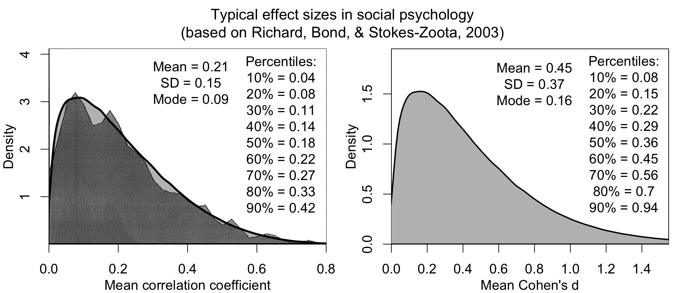

# Intuition for…
In this page, I intuitively explain interesting problems. I don't assume you know anything. 

## Logic:

<h3 style = "text-align: center; color: Aquamarine;">Why does anything follow from Falsehood?</h3>

The following is a true statement in logic:
> If I am a cat, I love eating dark matter.

If you don't know why this is true, logic is not what you think it is. In this post, I explain why many such absurd statements are true, and what this has to do with the foundations of logic.

This is the truth table for the conditional operator '->' (where 'A -> B' = 'if A then B'):

|   A   |   B   | A -> B | 
|:-----:|:-----:|:------:|
|   T   |   T   |   T    | 
|   T   |   F   |   F    |
|   F   |   T   |   T    |
|   F   |   F   |   T    |   

Read this row-by-row. The first row tells us that "A is True, B is True, A -> B is True." The galaxy-eating-cat-Kerem statement corresponds to the last row: A = Kerem is a cat (I am not, so this is false); B = I love eating dark matter (...also false, as far as I know); but somehow A -> B is true.

You may be wondering, *why on earth is A -> B only false in the second row?* 

There are two answers to this. First, there is an intuitive answer that makes the problem seem like a wording issue. The second answer, it turns out, is connected to the very foundations of logic, and reveals that the problem is not about wording at all. We’ll see both.

#### Misleading wording. 

‘Implication’ and ‘anything follows’ make logic sound like a machine that arbitrates objective truths about the world (i.e., a causal truth detector). It isn’t. Here is an example:

>If I am the pope, I can fly. 

If we were building a truth detector, we could just stop at the premise—I am not the pope, this is false. Maybe we are building a counterfactual truth detector—in that case, we need to read the implication, and compare it to our simulated world—if I were abducted and baptized and pope-ified, would I be able to fly?[^1] No. No matter how we spin it, the proposition being true seems bizarre. But we are not building a truth detector.

To scaffold our understanding, it is useful to first think of logic as a _lie detector._ Consider the following:

>Your honor, if am the pope, I can fly. 

This is a weird statement, but it’s not like I’m lying. I’m just not the pope. Similarly, the statement: 

>Your honor, if am the pope, I am Christian. 

Is not a lie. It is only a lie if the premise is true and what follows is false:

>Your honor, if my name is Kerem, I am the pope.

This is a lie, and it is coincidentally the only way we get falsehood from the truth table. So lie detection gives us the right intuitions in this case. 

#### Falsehood and the foundations of logic.

Why does lie detection work as a framing? And why is it the ‘right way’ to define the conditional operator ‘->’?

This framing works because lies are about contradictions, rather than falsehoods, and **logic is a machine for detecting consistent and ‘good’ inferences,** rather than truth. The ‘->’ operator is a primitive component of this machine. 

There is nothing _essentially correct_ about defining  ‘->’ this way, much like there is nothing essentially correct about the definition of any primitive component of a formal system. For example, pawns move forward in chess, but not because it is the right way for them to move. It is because chess is more fun when their movement is restricted in this way, and the goal of chess is to produce fun. Similarly, the goal of logic is to detect good inferences, and a primitive with properties similar to a lie detector turns out to be useful for that aim. **The definitions of primitives follow from what you want the system to be able to do.**

But it isn’t a priori obvious which primitives will achieve your goals; and typically, systems evolve primitives over time. For example, chess evolved as a system from its ancestors (e.g., the Egyptian senet): 

It’s not like board game designers knew what would be more fun—they just knew fun when they had it. Similarly, people were arguing and figuring out what is a good inference before they had formal logic.[^2] Formal logic was built to satisfy these ‘good inference’ criteria. 

#### Evolving logic.

For instance, the following inference, called a syllogism, seems solid: 

A [There are bees]

A -> B [If there are bees, then I scream]

∴ B [I scream]

So we want logic to identify this as a good inference. How do we do this? 

First, we can rewrite it as a single statement. The first two bits, when combined, should lead to the third. We can write the combination through ^ (the conjunction): 

A ^ (A -> B) -> B. 

We need to define ‘->’ in such a way that this sentence as a whole is evaluated as good, regardless of what the inputs (A, B) are, because we deemed this inference to be valid a priori. We will call a valid/good inference true, and an invalid inference false. 

We can show that the ‘lying framing’ works [i.e., the third column is only false when A = T & B = F; and the final column is all true, indicating that the full inference is always valid]:

|   A   |   B   | A -> B | A ^ (A -> B) | A ^ (A -> B) -> B |
|:-----:|:-----:|:------:|:------------:|:-----------------:|
|   T   |   T   |   T    |       T      |         T         |
|   T   |   F   |   F    |       F      |         T         |
|   F   |   T   |   T    |       F      |         T         |
|   F   |   F   |   T    |       F      |         T         |

We can try an alternative definition and see that it fails. Imagine that we go by the ‘truth detector’ setup for the ‘->’ operator. So the only time A -> B is true is if both A = T & B = T: 

|   A   |   B   | A -> B | A ^ (A -> B) | A ^ (A -> B) -> B |
|:-----:|:-----:|:------:|:------------:|:-----------------:|
|   T   |   T   |   T    |       T      |         T         |
|   T   |   F   |   F    |       F      |         F         |
|   F   |   T   |   F    |       F      |         F         |
|   F   |   F   |   F    |       F      |         F          |

This way of defining ‘->’ does not end up telling us that the inference as a whole is valid. The lie detector framing does, hence we use it as a primitive. And it works.

#### Why should this human-intuitive-definition turn out to be so useful? 

This is a nice puzzle for psychology. Probably because a human that drew useless inferences in simple cases would not survive. These kinds of arguments are called ‘dutch-book’ arguments.[^3] There is also something deeply unsatisfying about those, but that is a story for another time… 

[^1]: See [modal logic](https://en.wikipedia.org/wiki/Modal_logic). 
[^2]: Some even think that the origins of reasoning itself emerge from argumentation [(Mercier & Sperber, 2011)](https://doi.org/10.1017/S0140525X10000968). Seems unlikely, but interesting.
[^3]: These [arguments](https://plato.stanford.edu/entries/dutch-book/) are also used as evolutionary arguments for Bayesian approaches to cognition. 

---