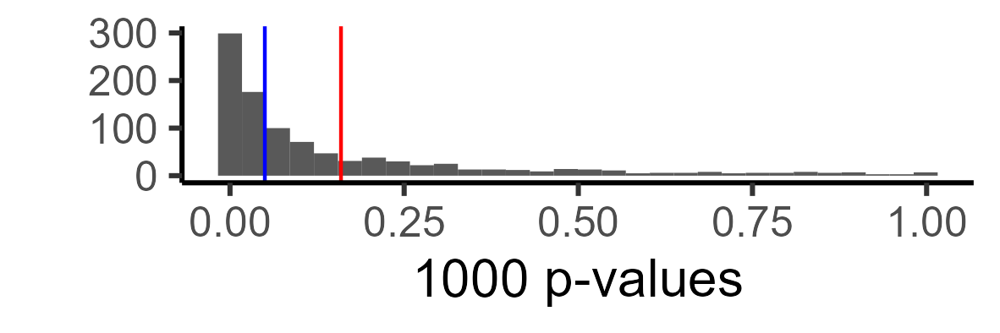

# How do I do X?
- For an simple R tutorial on power analyses, [click here](#power).
- [Other tutorials under construction...]

# <a name="power"></a> Power Analyses in R

## Intro to a cucumber-flavored tutorial.
Imagine that you tested negative for a fake disease, cucumberitis (congrats!). Should you celebrate? 

Maybe. It depends on whether the test is any good. In particular, how likely is the test to turn out negative when you actually have cucumberitis? If it often turns out negative inaccurately, that makes it a weak, bad test. A good, _powerful_ test would almost never do that---if it says that you are sick, it is because you are.

Powerful tests are therefore informative, and weak tests are misleading---in fact, you would probably be **very upset** if you learned that your medical test was weak (imagine a false-negative cancer test!). **In psychology, our tests are often much weaker than we think they are, and we should be upset, too;** because we often take costly actions (e.g., abondoning study designs, rejecting hypotheses, etc.) based on weak tests.

To know if you have a weak test, you minimally need to know two things: how big is your effect, and how big is your sample?  

### Why Do We Do Weak Tests?
> “I can’t do a power analysis because I have no idea what the effect size is. If I knew the effect size, I wouldn't have to run the study in the first place!

This is a common objection, and underlies why many still don't do power analyses---but it turns out, we know much more than we think we do. For instance, here is a distribution of effect sizes from a meta-analysis of meta-analyses in social psychology collecting effect sizes across ~25,000 studies over 100 years in diverse research areas (credits to Jake Westfall for [this analysis](http://jakewestfall.org/blog/index.php/2015/06/16/dont-fight-the-power-analysis/)):


It turns out that, knowing _nothing_ about your research question, I can still make an informed guess about your effect size (it's probably ~0.3; in particular because reported effect sizes tend to be [inflated](https://statmodeling.stat.columbia.edu/2023/05/25/effect-size-expectations-and-common-method-bias/)). 

Moreover, Joe Simmons has run some extremely helpful, large (N ~ 700) studies on the effect sizes of [very simple questions](http://datacolada.org/18#identifier_1_520). Consider a classic psych question: Do smokers think that smoking is less risky than non-smokers? What do you think the effect size is for this? It turns out to be ~.3. How about the likelihood that someone who likes eggs eats more egg salad? Effect size ~ .5.


The upshot of this is that even very obvious effects in psychology have 'small to moderate' effect sizes. If your manipulation is more subtle, you should expect your effect to be weaker. 

### You Should Trust Your Priors More Than Your Pilots.

Often, we'll do a smaller pilot study, and use the effect size estimates from that to do power analyses. This is probably not a good idea, unless your pilots are very large, mostly because getting tight bounds on effect sizes requires _very large_ samples, e.g., N > 3000 (see below, [courtesy of Uri Simonsohn](http://datacolada.org/20#footnote_1_545)) .


This means that your pilot tells you less than you think about how big your effect probably is.

## Implementing a Simple, Simulation-based Power Analysis in R
Hopefully you are vaguely convinced that you should try power analyses. Here is my favorite way to do them. 

The intuition is simple: Given some effect and sample, we want to know how likely we are to detect a true effect. To do this, you can just create a bunch of fake, random data such that the effect is actually there, and you see if you can detect the effect. If you do this ~1000 times, you get a good estimate of your likelihood of detecting a true effect.

Toy example: Does eating cucumbers make you less thirsty? This should be a very obvious effect, so let's say our effect size = .5 (similar to egg salad from above). What's your likelihood of detecting this in a typical psych sample, at p < .05? Let's say 30 people were given cucumbers and told to eat them; 30 people were not given cucumbers (so total N = 60). They then rated their thirstiness from 0-10. 

The no_cucumber group has an average thirstiness of 5. If the effect size is .5, we would expect the cucumber group to have a 4.5 thirstiness on average. Let's arbitrarily say that the standard deviation for thirstiness is at 1. Let's generate these samples and do a t-test:

```R
cucumber = rnorm(n = 30, mean = 4.5, sd = 1)
no_cucumber = rnorm(n = 30, mean = 5, sd = 1)

t.test(cucumber, no_cucumber)
```

In this instance, there was enough signal in the randomly generated data that I could find it:


But obviously this won't hold for all randomly generated data. The question is, for what proportion of these datasets? So we can loop over and randomly generate 1000 cucumber datasets, and collect the p-values:

```R
test_pvalues = c() #initiate list to store p values

for(dataset in 1:1000){
  cucumber = rnorm(n = 30, mean = 4.5, sd = 1)
  no_cucumber = rnorm(n = 30, mean = 5, sd = 1)
  test = t.test(cucumber, no_cucumber)
  test_pvalues = c(test_pvalues,
                   test$p.value) # append the p.value to our running list
}
```

Here is the distribution of p-values. Red shows the mean p-value, and blue shows p = .05. All p-values after the blue line, in this case, are false negatives (i.e., we are not detecting the effect).


Technically, this is more informative than a single number, but let's say you just want to know what your power is. We can just look at the proportion of our 'experiments' in which we found a significant relationship:

```R
mean(ifelse(test_pvalues < .05, 1,0)) #ifelse assigns 1 if the test was significant, 0 if not, we then average it out with mean. I got .45.
```

So our power in this case ~.47. We can increase the number of experiments (e.g., from 1k to 10k) to get more precise estimates; or we can change various parameters (e.g., what if our variance was 2 vs. 1?) to see how they change our power. 

We can also ask, what is the sample size you would need to get good (e.g., 90%) power? There are many ways to do this. I find simulations very intuitive, so I just search through possible sample sizes that might make sense, and see what power they are at. In this case, we need a total sample size of 170 to detect our cucumber effect:


And here is the code for looping over multiple sample sizes:

```R
power_estimates = c() #initialize to store power estimates
samplesizes = seq(50,300,10)
for(samplesize in samplesizes){ #loop over possible sample sizes
  test_pvalues = c() #initiate list to store p values
  for(dataset in 1:1000){
    cucumber = rnorm(n = samplesize / 2, mean = 4.5, sd = 1)
    no_cucumber = rnorm(n = samplesize / 2, mean = 5, sd = 1)
    test = t.test(cucumber, no_cucumber)
    test_pvalues = c(test_pvalues,
                     test$p.value) # append the p.value to our running list
  }
  powerest = mean(ifelse(test_pvalues < .05, 1,0))
  power_estimates = c(power_estimates, 
                      powerest) # append power estimate to list
}
```

One shortcoming of this method is that it uses loops in R, which are notoriously slow; for more complex analyses, you will either want to optimize the code above, or use an established power analysis library for the particular test you want to run.

## Outro: Power Matters.
I wrote this up because I have done tens of studies with thounds of participants, which, in retrospect, told me a lot less than I thought they did. In the example above, running a 'standard' N = 30 per-cell design gives us ~.5 power. So there's an even chance it didn't work out because the effect actually doesn't exist vs. we couldn't detect it because we're underpowered. There's linear returns to power in this simple setting, so if we had recruited twice the sample size, we would actually have known that if we don't find an effect, it's because there isn't one there.

**I could have learned so much more about which effects are real, and which aren't, by conducting fewer, better powered studies.** And we would all stop wasting money and time if everyone conducted well-powered studies and reported when they failed.

For more info on why this matters for psychology research, check out the article by Paul Meehl in my list of favorite [articles](./paperpile.html), or check out Uri, Joe, and Jake's posts above. [Data-colada](https://datacolada.org/) in particular has a lot of useful wrote-ups on this.

* * * 


