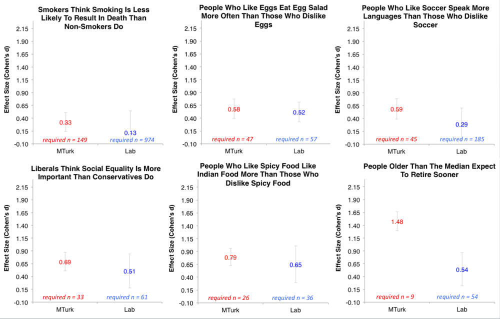

<!-- https://github.com/pages-themes/minimal/blob/master/index.md?plain=1 -->
# How do I do X?
- For an simple R tutorial on power analyses, [click here](#power).

# <a name="power"></a> Power Analyses in R

## Intro: A Deadly Disease
Imagine that you tested negative for a deadly disease. Should you celebrate? It depends on the following: How likely is the test to just say negative---even when you are sick---because it is a weak, bad test? A good, _powerful_ test would almost never do that---if it says that you are sick, it is because you are.* Powerful tests are therefore informative, and weak tests are misleading---in fact, you would probably be **very upset** if you learned that your medical test was weak (imagine a false-negative cancer test!). **In psychology, our tests are often much weaker than we think they are, and we should be upset, too;** because we often take costly actions (e.g., abondoning study designs, rejecting hypotheses, etc.) based on weak tests.

To know if you have a weak test, you minimally need to know two things: what big is your effect, and how big is your sample?  

### Why Do We Blindly Do Weak Tests? You Know More Than You Think. 
> “I can’t do a power analysis because I have no idea what the effect size is. If I knew the effect size, I wouldn't have to run the study in the first place!

This is a common objection, and underlies why many still don't do power analyses---but it turns out, we know much more than we think we do. For instance, here is a distribution of effect sizes from a meta-analysis of meta-analyses in social psychology collecting effect sizes across ~25,000 studies over 100 years in diverse research areas (credits to Jake Westfall for [this analysis](http://jakewestfall.org/blog/index.php/2015/06/16/dont-fight-the-power-analysis/)):


It turns out that, knowing _nothing_ about your research question, I can still make an informed guess about your effect size (it's probably ~0.3; in particular because reported effect sizes tend to be [inflated](https://statmodeling.stat.columbia.edu/2023/05/25/effect-size-expectations-and-common-method-bias/)). 

Moreover, Joe Simmons has run some extremely helpful, large (N ~ 700) studies on the effect sizes of [very simple questions](http://datacolada.org/18#identifier_1_520). Consider a classic psych question: Do smokers think that smoking is less risky than non-smokers? What do you think the effect size is for this? It turns out to be ~.3. How about the likelihood that someone who likes eggs eats more egg salad? Effect size ~ .5.



The upshot of this is that even very obvious effects in psychology have 'small to moderate' effect sizes. If your manipulation is more subtle, you should expect your effect to be weaker. 

### You Should Trust Your Priors More Than Your Pilots.

Often, we'll do a smaller pilot study, and use the effect size estimates from that to do power analyses. This is probably not a good idea, unless your pilots are very large, mostly because getting tight bounds on effect sizes requires _very large_ samples, e.g., N > 3000 (see below, [courtesy of Uri Simonsohn](http://datacolada.org/20#footnote_1_545)) .

{: width="50%"}

This means that your pilot tells you less than you think about how big your effect probably is.

## Implementing a Simple Power Analysis in R
Hopefully you are vaguely convinced that you should try power analyses. Here is my favorite way to do them. 

The intuition is simple: Given some effect and sample, we want to know how likely we are to detect a true effect. To do this, you can just create a bunch of fake, random data such that the effect is actually there, and you see if you can detect the effect. If you do this ~1000 times, you get a good estimate of your likelihood of detecting a true effect.

Toy example: Does eating cucumbers make you less thirsty? This should be a very obvious effect, so let's say our effect size = .5 (similar to egg salad from above). What's your likelihood of detecting this in a typical psych sample? Let's say 30 people were given cucumbers and told to eat them; 30 people were not given cucumbers (so total N = 60). They then rated their thirstiness from 0-10. 

The no_cucumber group has an average thirstiness of 5. If the effect size is .5, we would expect the cucumber group to have a 4.5 thirstiness on average. Let's arbitrarily say that the standard deviation for thirstiness is at 1. Let's generate these samples and do a t-test:

```R
cucumber = rnorm(n = 30, mean = 4.5, sd = 1)
no_cucumber = rnorm(n = 30, mean = 5, sd = 1)
```


* * * 

*:(formally, Power = P(identify H0 = F | H1 = T) = 1 - false negative rate)

One of my favorite [articles](./paperpile.html) is by Paul Meehl on this exact problem.


